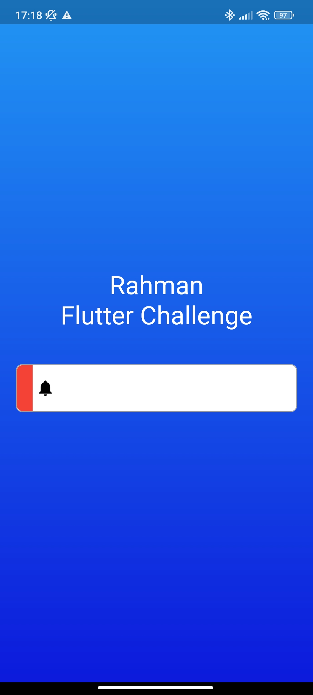

 

# Flutter Challenge App 📱

Este App é um desafio do Rodrigo Rahman.
O desafio consiste em implementar o componente mostrado abaixo

## Pre-requisitos 📐

| Tecnologia | Versão recomendada | Guia de instalação                                                    |
| ---------- | ------------------ | --------------------------------------------------------------------- |
| Flutter    | v3.7.3             | [Flutter Official Docs](https://flutter.dev/docs/get-started/install) |
| Dart       | v2.19.2            | Instalado automaticamente com o Flutter                               |

## Vamos começar 🚀

- Clone this project
- Run `flutter pub get` para instalar as dependências
- Run `flutter run` para rodar

